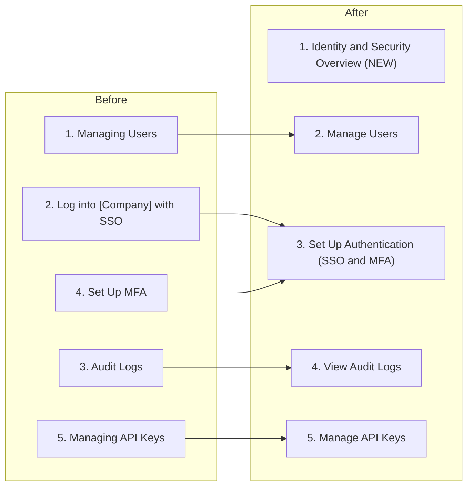

export const metadata = {
  title: "How I Used AI to Audit a Cloud Provider's Developer Docs",
  date: "2026-04-23",
  coverImage: "/blog/blog-ai-audit-notes.png",
  excerpt:
    "A cloud infrastructure company asked me to live audit a section of their docs. I used AI to assist — here's what I learned about the process.",
};

A cloud infrastructure company asked me to live audit a section of their docs as part of a technical writing interview. I didn't know what topic they were going to ask me about, so I thought about what I should do to prepare.

Previously, I went through docs mostly manually and wrote down some notes when I noticed things I would fix. It was easier to spot style inconsistencies like capitalization errors, or future tense when they really should be using present tense, but making larger information architecture fixes required significantly more effort. It didn't seem worth it for a potential 30-60 minute interview, especially if I wasn't familiar with the domain.

I've been experimenting using AI to help prepare for these live interviews within the last few months with great success. I would go through the docs and write down notes about what I would improve, then have Claude read through independently and compare notes. Up until this point, most companies restricted the usage of AI during the interview itself, but some encouraged using it to prepare. I think using AI to prepare for mock questions and evaluate your own work is fair game.

30 minutes before the interview, the company recruiter called me to tell me that I should be using AI _during_ the interview. As in, I should choose an AI tool and have it live assist me for the docs audit. He asked me if I wanted to reschedule to better prepare, but I told him to go ahead with the scheduled time. I felt confident enough in my skills, and I was using AI to prepare anyway, so I figured I was going to do well.

I had 40 minutes to evaluate around 6 pages worth of work. So I got cracking immediately.

## The Setup

The ask was relatively straightforward: review the company docs (specifically the IAM section), flag issues, and propose improvements. What was markedly different was that the interviewer asked me to screenshare so he could see my progress, and use whatever AI tool I preferred to assist me with my audit.

My approach was to do a full manual review first, taking notes against a mental checklist (style guide compliance, information architecture, audience fit, formatting). In parallel, I fed the same pages to Claude and asked it to review the docs and suggest improvements. After that, I compared findings.

### Why not have AI go through the docs to start with?

Why even read through the docs on my own? Personally, I think there's still a level of ownership that's required with using AI in docs. I think AI tools are definitely powerful enough to provide great insight into how to improve, or even write first drafts, but it doesn't replace the human docs ownership for calling shots on what to improve, what to keep, and what to discard. Using AI to review docs is awesome - maybe even necessary! - but using AI doesn't replace understanding for subject matter.

## My audit

There were some obvious things that I noticed immediately and would improve. I didn't have a lot of time, so I took a quick and dirty approach by jotting down what I could to demonstrate my writing skills.

Some things that I noticed that Claude didn't:

* **Empty UI tabs suggesting planned but unpublished content.** The Managing Users page had a singular tab that was labeled "UI" for multiple text blocks. It seemed to suggest there was unpublished content or a plan for non-UI methods for managing users. It's not immediately damaging the docs bottom line, but this formatting could be interpreted as less polished.

* **A critical admin action buried in prose.** The MFA page had this sentence: "As an admin, you can reset MFA methods for users in your organization if they are locked out." I thought this instruction was pretty important, and warrants a warning callout. Lockouts are pretty costly for an organization and individual productivity, so I would personally highlight that part of the text to emphasize its importance.

* **Unordered lists for sequential steps.** The Managing Users page used bullet points for procedures that had a specific order. In this specific list, subsequent steps depended on previous steps, and should be a numbered list.

* **Information architecture felt off.** Even on my first read-through, the section felt like it was organized in the order features were built, not the order someone would use them. MFA was separated from SSO by two unrelated sections. Audit logs sat in the middle instead of at the end. I had a rough sense of what a better structure would look like before I even checked Claude's output.

## Claude's audit

### Pass 1: Let it run wide

My first prompt was open-ended: "Can you review the docs and suggest improvements?" I wanted to see what Claude would catch without any direction from me.

It came back with a lot. Heading hierarchy issues, the "in order to" pattern appearing everywhere, repeated boilerplate steps, mixed voice and verb forms across page titles, the API keys typo, terminology inconsistency, thin pages. It reviewed all six pages at once and produced a comprehensive dump of issues in seconds.

This is where AI's breadth pays off. It can scan across pages simultaneously and catch patterns that are tedious to track manually:

**Repeated boilerplate.** The Managing Users page repeated the same three navigation steps (visit the console, select the Organization dropdown, select the User Access tab) four times across viewing, inviting, changing roles, and removing users. I read through those steps each time and my brain auto-completed them. Claude flagged the repetition immediately and suggested extracting them into a shared prerequisite at the top of the section.

**Terminology inconsistency.** The API Keys page title said "API keys" but the UI steps referenced "tokens" ("Create token," "Tokens section"). The Managing Users page also mentioned tokens inheriting user permissions. The relationship between "API keys" and "tokens" was never defined. Within any single page, it read fine. Across pages, it was confusing. I noted this too, though I thought the distinction might not be strictly necessary for the audience. Claude was more aggressive about flagging it.

**A typo in a destructive-action warning.** "This action cannot been undone." I read right past it. Claude caught it in the first pass. On a page about permanently deleting API keys, that's the one sentence you really want to get right.

**Thin pages that didn't match the depth of their neighbors.** Claude pointed out that the MFA page was essentially three short paragraphs with links, while Managing Users and API Keys had full step-by-step UI walkthroughs with tabbed interfaces (UI, CLI, Terraform, API). The inconsistency in depth wasn't something I'd noted explicitly. It also caught that the SSO page used a completely different formatting pattern (bold labels in a numbered list) from every other page in the section, like a different author wrote it.

Letting Claude go wide like this is a multiplier. In the time it took me to read through a few pages and jot down notes, it had already reviewed everything and surfaced cross-page patterns I would have needed much longer to catch.

### Pass 2: Steer toward structure

The first pass gave me a pile of findings, but I wanted to go deeper on the information architecture. I asked Claude: "Do you think there are structural changes you would make to the information hierarchy, or potentially combining topics?"

Claude went big. It proposed pulling API Keys out of the section entirely, creating separate admin and developer guides, restructuring the Quickstart, and consolidating the Reference section. It also identified the two-audience problem: the entire section was serving administrators and developers with no routing between them. An admin setting up SSO and a developer generating API keys were entering through the same landing page with no way to tell which content was for them.

Good ideas. But too broad for a 40-minute exercise on one section.

### Pass 3: Narrow the scope

I pulled it back: "Let's focus on the Identity and Security section for this audit, rather than sweeping changes for the whole docs. What changes can we make to this particular section that improve the happy path for both developers and admins?"

This is where the output got practical. Claude took the same structural insights and scoped them down: add an overview page with audience routing, merge the thin SSO and MFA pages, promote the buried "Understanding Roles" content, reframe API Keys as a developer entry point. All within the existing section, no site-wide changes.

### Pass 4: Push back on specifics

Even scoped down, Claude's suggestions needed editing. It proposed renaming the merged SSO+MFA page to just "Authentication." I pushed back: "I don't like that the title changes to 'Authentication,' since you lose the search terms that directly let users look for MFA and SSO." We iterated and landed on "Set Up Authentication (SSO and MFA)," which kept the search terms in the title.

This is the pattern I've found works best for AI-assisted reviews: let it run wide first to multiply your output, then progressively narrow the scope and correct it where your judgment disagrees. The broad pass catches things fast. The focused passes turn those findings into something you can present. And you still need to read through everything yourself to make the final calls.

## Where We Iterated Together

The most useful part wasn't what either of us found independently. It was the back-and-forth.

**The heading consistency debate.** The existing nav was a mess of styles: "Managing Users" (gerund), "Log into [Company] with Single Sign-On" (imperative phrase), "Audit Logs" (noun), "Set Up Multi-Factor Authentication" (imperative), "Managing API keys" (gerund). Three different conventions in five items. Claude proposed verb-noun imperative across the board: "Manage Users," "Set Up Authentication," "View Audit Logs," "Manage API Keys." Good reasoning: imperative titles tell users what they can *do*, which fits task-based documentation. I agreed.

**The restructure.** I'd already noted the IA problems in my own review, and Claude had flagged the two-audience issue independently. Together we landed on a new structure:

The overview page was Claude's idea. The audience routing ("admins start with Manage Users, developers jump to API Keys") came from our discussion about the two-audience problem. Moving audit logs to the end was mine (reference content belongs last). Merging SSO and MFA into one page was a collaborative call after we both noticed they were too thin to stand alone. Promoting the "Understanding Roles" content (previously buried halfway down the Managing Users page) to the overview was another joint decision.

Same page count. Better information architecture. Neither audience has to sift through content meant for the other.

## What This Taught Me

I've done plenty of audits the traditional way. Adding AI to the process didn't replace any of the skills I've built. It changed where I spent my time.

**AI is good at systematic consistency checks.** Terminology, heading patterns, repeated boilerplate, cross-page depth comparison. The work that takes hours manually and minutes with AI. If you're reviewing more than a handful of pages, this alone is worth the setup time. With some skill management or agent orchestration, this can go a long way toward polishing the consistency of your docs.

**Humans are better at editorial judgment.** Knowing that a destructive action needs visual prominence. Understanding that users scan before they read. Recognizing that empty tabs signal a product gap, not a content gap. Spotting that audit logs belong at the end because that's how admin workflows progress. These require context about how documentation gets used in practice, not just what the text says. There's still no getting around having a human who puts dedication and care into how the docs feel to other human users.

**The real value is the feedback loop.** AI proposes, you refine. You catch something, AI helps you articulate the fix. The best results came from treating Claude as a collaborator with a different perspective, not an oracle. When it was wrong (the "Authentication" naming issue), pushing back led to a better answer than either starting point.

**This scales.** I covered six pages in 40 minutes with both reviews running in parallel. That same workflow could cover an entire docs site. The manual review doesn't go away, but the AI pre-pass means you spend your human attention on the problems that need human attention, not on counting how many times "API keys" appears across a section. I'm still pretty amazed at how much extra productivity mileage I get out of a few prompts.

I get asked often: if AI can write all of the content, why do I need to hire a tech writer? I've struggled with that question myself. There's a line between AI-written content and ownership. Even if AI can write the bulk of the content, you still need someone to steer the docs in a good direction. You need someone who understands _why_ we use present tense instead of future tense. You need someone familiar with the context to deliver the best docs experience for customers. You want someone who can think about the docs as a whole that's greater than the sum of its parts.

AI doesn't replace the need to read through the docs yourself. It can scan for patterns and flag inconsistencies, but it doesn't build the mental model that comes from sitting with the content page by page. A tech writer who hasn't read the docs can't make good judgment calls about what's missing, what's in the wrong place, or what a user will stumble on. AI can help you move faster, but it can't own the docs for you. That understanding has to live in a person's head.

At this point, I think all docs audits can benefit from AI assistance. If you're working in software docs and you're not at least experimenting with this, you're leaving value on the table. The disagreements between your review and the AI's review will surface problems neither of you would have found on your own.
