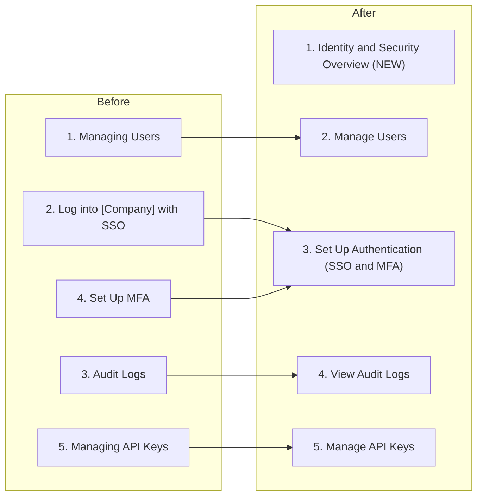

export const metadata = {
  title: "How I Used AI to Audit a Cloud Provider's Developer Docs",
  date: "2026-04-23",
  coverImage: "/blog/blog-ai-audit-notes.png",
  excerpt:
    "A cloud infrastructure company asked me to live audit a section of their docs. I used AI to assist — here's what I learned about the process.",
};

A cloud infrastructure company asked me to live audit a section of their docs as part of a technical writing interview. I didn't know what topic they were going to ask me about, so I thought about what I should do to prepare.

I'd done these audits before — go through the docs manually, jot down what I'd fix, and present my findings. That approach catches surface-level issues like style inconsistencies, but spotting information architecture problems takes significantly more time, and wasn't always feasible in a 30-40 minute interview.

Recently I'd started using AI to prepare: review the docs myself, then have Claude review independently, and compare notes. Most companies didn't allow AI during the interview itself, but using it to prepare felt like fair game.

30 minutes before the interview, the company recruiter called me to tell me that I should be using AI _during_ the interview. He said I should choose an AI tool and have it live assist me for the docs audit, and asked if I wanted to reschedule to better prepare. I told him to go ahead with the scheduled time. I felt confident enough in my skills, and I was using AI to prepare anyway, so I figured I was going to do well.

I had 40 minutes to evaluate around 6 pages worth of work. So I got cracking immediately.

## The Setup

The ask was relatively straightforward: review the company docs (specifically the IAM section), flag issues, and propose improvements. What was markedly different from other interviews was that the interviewer asked me to screenshare so he could see my progress, and use whatever AI tool I preferred to assist me with my audit.

My approach was to do a full manual review first. This would let me take in the context for what the docs are about, and I could get a first impression on how the docs look and feel (similar to how a new user might approach the docs). In parallel, I fed the same pages to Claude and asked it to review the docs and suggest improvements. After that, I compared findings.

### Why not have AI go through the docs to start with?

Why even read through the docs on my own? I think there's still a level of ownership that's required with using AI in docs. AI tools are definitely powerful enough to provide great insight into how to improve, or even write first drafts, but it doesn't replace the human docs ownership for calling shots on what to improve, what to keep, and what to discard. Using AI to review docs is awesome - maybe even necessary! - but using AI doesn't replace understanding subject matter.

## What we found

Here's a summary of who caught what:

| Finding | Me | Claude | Both |
|---|:---:|:---:|:---:|
| Empty UI tabs (possible unpublished content) | ✓ | | |
| MFA admin reset buried in prose | ✓ | | |
| Unordered lists for sequential steps | ✓ | | |
| Notes inline instead of callouts | ✓ | | |
| Typo: "cannot been undone" | | ✓ | |
| Thin MFA/SSO pages vs. detailed neighbors | | ✓ | |
| SSO page uses different formatting pattern | | ✓ | |
| Section needs an overview/summary page | | ✓ | |
| Two-audience problem (admin vs. developer) | | ✓ | |
| Style/grammar issues (tense, voice, gerunds) | | | ✓ |
| Heading conventions inconsistent | | | ✓ |
| Terminology inconsistency (API keys vs. tokens) | | | ✓ |
| Information architecture felt disorganized | | | ✓ |

I would say AI is quite good at auditing docs — certainly faster than me, especially during a 40 minute live interview — but it doesn't "see" docs in the same way that humans do. I also think it's not the end-all-be-all tool, and requires some level of human intervention to generate the best output.

## My audit


There were some obvious things that I noticed immediately and would improve. I didn't have a lot of time, so I took a quick and dirty approach by jotting down what I could to demonstrate my writing skills.

Some things that I noticed that Claude didn't:

* **Empty UI tabs suggesting planned but unpublished content.** The Managing Users page had a singular tab that was labeled "UI" for multiple text blocks. It seemed to suggest there was unpublished content or a plan for non-UI methods for managing users. It's not immediately damaging the docs, but this formatting could be interpreted as less polished.

    

* **A critical admin action buried in prose.** The MFA page had this sentence: "As an admin, you can reset MFA methods for users in your organization if they are locked out." I thought this instruction was pretty important, and warrants a warning callout. Lockouts are pretty costly for an organization and individual productivity, so I would highlight that part of the text to emphasize its importance.

* **Unordered lists for sequential steps.** The Managing Users page used bullet points for procedures that had a specific order. In this specific list, subsequent steps depended on previous steps, and should be a numbered list.

## Claude's audit

My first prompt was open-ended. I wanted to see what Claude would catch without any direction from me.

```
Can you review the docs and suggest improvements?
```

It reviewed all six pages at once and produced a list of issues in seconds. Here's some highlights Claude found that I missed:

* **A typo in a destructive-action warning.** "This action cannot been undone" on the API Keys page.
* **Thin pages with inconsistent formatting.** The MFA and SSO pages were much shorter than their neighbors, and the SSO page used a completely different formatting pattern from every other page in the section.
* **A two-audience problem.** Admins and developers were entering through the same landing page with no routing between them.

In the time it took me to read through a few pages and jot down notes, Claude had surfaced cross-page patterns I would have needed much longer to catch on my own. While I would like to read through every doc in detail, there wasn't enough time during this particular interview to do so. In a real corporate environment, there might not be enough time to do so before a deadline, either.

### Narrowing the scope

The initial broad pass was useful, but each follow-up prompt needed to narrow Claude's focus. Here's how the conversation progressed:

| Prompt | What Claude did |
|---|---|
| "can you review the docs and suggest improvements?" | Reviewed all six pages and flagged style issues, inconsistent headings, thin pages, terminology problems, and a typo. Fast and broad. |
| "do you think there's structural changes you would make to the information hierarchy, or potentially combining topics?" | Proposed pulling API Keys out of the section entirely, restructuring the global nav, and reframing Identity and Security as an admin-only section. Ambitious but way too broad for a 40-minute exercise. |
| "would you consider an admin guide and a developer guide, or admin quickstart/developer quickstart?" | Sketched out full separate guide structures with page-level outlines. Good long-term thinking, but still beyond the scope of the interview. |
| "let's focus on the identity and security section for this audit, rather than sweeping changes for the whole docs. what changes can we make to this particular section that improves the happy path for both developers and admins?" | Output got practical: add an overview page, merge thin SSO and MFA pages, promote buried "Understanding Roles" content, rename pages to a consistent verb-noun imperative pattern. |
| "i don't particularly like that the title of the topic is changed to 'Authentication', since you lose the search terms that directly let users/admins look for (MFA, SSO)" | Course-corrected to "Set Up Authentication (SSO and MFA)" to keep search terms in the title. |

AI optimized for naming consistency but missed discoverability. That's the kind of judgment call that AI doesn't make on its own.

## Proposed restructure

I'd already noted the IA problems in my own review, and Claude had flagged the two-audience issue independently. Together we worked out a new structure:




The rationale behind each change:

- **Overview page:** The section had no landing page explaining what IAM covers or where to start. I thought a short overview topic directing users where to go would be friendly and helpful.
- **Merged SSO and MFA:** Both pages were very short. Combining them into one authentication page gives admins a single place for all auth configuration.
- **Audit logs moved to the end:** Audit logs are reference material. Admins set up users and authentication first, then monitor activity. The order should match the workflow.
- **"Understanding Roles" promoted to overview:** This content was buried halfway down the Managing Users page, but roles and permissions are the conceptual foundation for the entire section.

The actual content stays the same, but now both admin and developer users can find their respective docs faster. I believe this is better information architecture.

## Conclusions

I get asked often: if AI can write all of the content, why do I need to hire a tech writer?

After this exercise, here's what I think:

- **AI is good at systematic consistency checks.** It can spot patterns in seconds. Any tech writer can (and should!) start using AI to do a quick pass through their docs immediately.

- **Humans are better at editorial judgment.** AI doesn't see how docs appear on screen. A human who puts care into how docs feel to other humans is still necessary. Good docs could be the difference between a user who chooses your product and one who doesn't.

- **The real value is the feedback loop.** AI proposes, you refine. You catch something, AI helps you articulate the fix. Treat Claude like another writer, not an infallible AI overlord.

- **This scales.** I covered six pages in 40 minutes with both reviews running in parallel. The same workflow could cover an entire docs site. The AI pre-pass lets you spend your human time and attention on the problems that need it.

Even if AI can write the bulk of the content, you still need someone to steer the docs in a good direction. You need someone who understands _why_ we use present tense instead of future tense. You need someone who can think about the docs as a whole that's greater than the sum of its parts. AI can help you move faster, but it can't own the docs for you. That understanding has to come from a human author.
