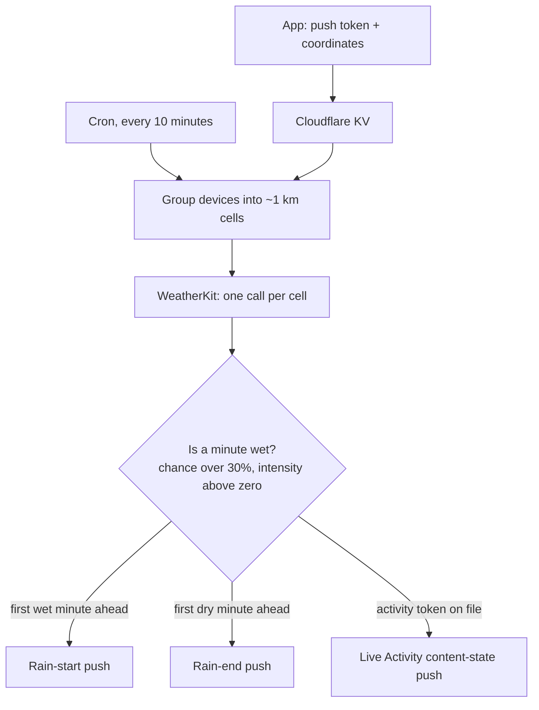

export const metadata = {
  title: "Gonna Rain?",
  tagline:
    "Minute-by-minute rain alerts for iOS, live on the App Store.",
  image: "/gonna-rain.png",
  tags: ["Swift", "SwiftUI", "WeatherKit", "Cloudflare Workers"],
  links: {
    "App Store": "https://apps.apple.com/us/app/gonna-rain/id6759902655",
  },
};

import RainBuildTimeline from "@/components/RainBuildTimeline";
import Figure from "@/components/Figure";

## Background

Even on rainy days, there are moments when the rain lets up for half an hour, and that's enough time to walk the dog quickly when otherwise you might not get the chance to. Granular weather updates are already available in my area through the native iOS weather app, but I wanted more active notifications to announce when exactly rain would stop, instead of having me obsessively check my phone every 10 minutes.

Luckily, the same weather data is available in Apple's WeatherKit. All I had to do was make a nice-looking application that served the notifications that I wanted.

## What it does

`Gonna Rain?` shows you the next hour minute-by-minute, the next twelve hours, and the week — then gets out of the way. The background is the weather: it darkens when it rains, goes navy and speckled when it snows.

<Figure
  cols={3}
  items={[
    { src: "/gonna-rain/app-rain.png", label: "Raining", caption: "hero flips to time-until-it-stops" },
    { src: "/gonna-rain/app-clear.png", label: "Clear", caption: "the week, when there's nothing to say" },
    { src: "/gonna-rain/app-snow.png", label: "Snowing", caption: "night gradient, falling flakes" },
  ]}
/>

<Figure
  cols={3}
  items={[
    { src: "/gonna-rain/la-lockscreen.png", label: "Lock Screen", caption: "the full card, on the wallpaper" },
    { src: "/gonna-rain/la-island-expanded.png", label: "Island, expanded", caption: "held open: countdown and the same track" },
    { src: "/gonna-rain/la-island-compact.png", label: "Island, compact", caption: "a glyph and the time left" },
  ]}
  caption="Three of the four presentations iOS defines, all driven by one content state. The fourth, minimal, only appears when another app is running an activity at the same time."
/>

## The build

<RainBuildTimeline />

Just building the basic weather function for the app was quite easy — I think anyone with experience building apps using AI can probably one-shot this in a matter of minutes. What was hard was determining the notification logic, asking for correct permissions, and making it look nice.

### Fun animations

It took a lot of trial and error to get the animations in a nice place. Claude did most of the heavy lifting, but I had 

TK this sentence stops mid-thought. what was the part you had to do yourself on the animations?

<Figure
  items={[
    { src: "/gonna-rain/debug-picker.png", label: "Debug builds only", caption: "every condition and time of day as a pill, plus intensity and a hail toggle" },
  ]}
/>

Here are example animations that I finally landed on:

<Figure
  cols={3}
  items={[
    { src: "/gonna-rain/anim-rain.gif", label: "Heavy rain", caption: "streaks, angled, varied in length and speed" },
    { src: "/gonna-rain/anim-snow.gif", label: "Snow", caption: "flakes drift and wobble instead of dropping straight" },
    { src: "/gonna-rain/anim-hail.gif", label: "Hail", caption: "fewer, rounder, faster" },
  ]}
  caption="Hail is forced from the picker, so the headline behind it still reads from the rain scenario it was drawn over."
/>

### Notifications

The native iOS app DOES tell you when it's going to rain. But by the time I check on the weather, sometimes the weather has already changed, and I'm not able to plan effectively. I also have a threshold for rain — maybe I'm okay with a little rain, but I'm not happy to go out when it's pouring outside.

This does feel a little overengineered, but it was becoming a real pain to look outside the window to see if it was still raining or not. And even when you look outside, sometimes it's hard to see actual raindrops falling.

<Figure
  cols={2}
  items={[
    { src: "/gonna-rain/notif-copy-v1.png", label: "v1", caption: "every message ended in advice" },
    { src: "/gonna-rain/notif-copy-v2.png", label: "v2", caption: "the advice cut, the facts kept" },
  ]}
/>

I wanted my notifications to spam me repeatedly each time rain started and stopped.

The app can't do that by itself. iOS decides when to wake it, and it won't wake it at all if you haven't opened it in days — which is exactly when you most want to be told. So the watching happens on a Cloudflare Worker, and the phone is only ever something that gets pushed to.

1. The app registers a push token, your coordinates and your lead time. That's the whole record; there's no account.
2. The cron rounds every coordinate to two decimal places — roughly a kilometre — and groups devices by that key. Everyone in the same neighbourhood costs one WeatherKit call, not one each.
3. A minute counts as wet when the chance is over 30% and the intensity is above zero. The first wet minute ahead is the start. If it's already wet, the first dry minute ahead is the end.
4. You get the start push only if it falls inside your own lead time, and the end push only within half an hour of it. Each one writes a key that suppresses the same kind of push for the next thirty minutes, which is where "spam me repeatedly" stops short of actual spam.
5. If a Live Activity is running, the app sends that activity's own token up too, and the same tick pushes it a fresh content state. When the dry minute finally lands, that push is marked as the ending one and the token is dropped.

TK that threshold is the same for everybody — 30% chance, any intensity above zero — and there's no setting for it anywhere in the app. up in Notifications you say you have a threshold for rain and aren't happy going out when it's pouring. do you want to soften that line, or should a per-user intensity threshold go in What's next?

Every push is signed with a provider token from Apple. Apple lets you reuse one for an hour, and starts returning 429s if you keep asking for new ones, so the Worker mints one and holds it for forty minutes rather than per notification.

Two things here were not obvious. A date inside a Live Activity payload is decoded as seconds since 2001, not since 1970, so a countdown encoded the ordinary way doesn't come out merely wrong — the whole push fails to decode and the card silently stops moving. And the content state is a replacement, not a merge: leave the precipitation type out of one push and the next tick turns a snowing card back into a rain card.

The app still runs its own check whenever it's open, and that one wants the same answer twice in a row before it fires. A minute of rain that appears and vanishes between two polls isn't worth a notification.

### Live notifications

I really like how apps like DoorDash and Lyft structure their live notifications. There's a progress bar for when something is about to be done. That's the design language I borrowed from: the track, the countdown, and one line of context.

I wanted to recreate that experience with the weather app. I think it's extremely useful to reflect that granular rain information on the lock screen, so I know exactly when I'm able to step out.

<Figure
  items={[
    { src: "/gonna-rain/la-v2-card.png", label: "v2", caption: "the app's own chart, miniaturised" },
    { src: "/gonna-rain/la-v3-card.png", label: "v3", caption: "a thin track: white dot is now, cyan is rain" },
  ]}
/>

I decided eventually to use a flat bar, similar to conventional live activity notifications. The chart, while informative, makes the lock screen too cluttered.

### Snow (1.1.1)

Snow became the next natural weather phenomenon to focus on. The logic was built out already, but I wanted it to look cool.

<Figure
  cols={2}
  items={[
    { src: "/gonna-rain/snow-ice.png", label: "Ice", caption: "pale ice-blue — closest to the rain card" },
    { src: "/gonna-rain/snow-frost.png", label: "Frost", caption: "near-white silver, least colour of the four" },
    { src: "/gonna-rain/snow-periwinkle.png", label: "Periwinkle", caption: "cooler violet, most separable at a glance" },
    { src: "/gonna-rain/snow-granular.png", label: "Granular", caption: "discrete flecks — snow as texture, not hue" },
  ]}
  caption="Round one: four directions, drawn at the real card's dimensions and type scale so the comparison would hold. I picked Frost, then spent two more rounds pushing it whiter until the blue was almost entirely out."
/>

If you're working on a project that demands that you draw things in your design, I encourage you to ask your agent to spin up multiple designs, then output an HTML page for you to pick and choose something. I unfortunately wasn't using it for this project, but a tool like [Lavish](https://github.com/kunchenguid/lavish-axi) is extremely useful as a visual-based option for providing feedback and choosing between designs.

<Figure
  items={[
    { src: "/gonna-rain/card-rain.png", label: "Rain", caption: "cyan track, droplet" },
    { src: "/gonna-rain/card-wintry.png", label: "Wintry", caption: "near-white track, snowflake, tinted ring" },
  ]}
  caption="The same card, rendered on device. Sleet, hail and mixed all share the wintry treatment."
/>

## Final thoughts

Claude wrote most of this code, as it did for [Potter Journal](/projects/potter-journal). What was different here is how much of the non-code work it did well.

Every design comparison on this page — the notification copy sheet, the two Live Activity directions, the snow palettes — is a Claude-generated HTML mockup, built to mirror the real view's dimensions and type scale so the comparison would hold. That turned out to be the highest-leverage thing in the project. Choosing between four snow treatments took me about a minute because I was looking at four snow treatments; describing them in prose and imagining them would have taken longer and produced a worse answer. The mockups are archived in the repo with the rejected options intact, so revisiting a decision doesn't mean rebuilding the alternatives.

It was also good at the parts that are just tedious: working out that a rate limit came from asking for a fresh login token on every single notification instead of reusing one, or writing a script that drives every state of the lock screen card so I don't have to wait for weather.

What it could not do was notice that the app had been drawing the track in the wrong place for a month. That took rendering the thing and looking at it. AI collapses the cost of producing an option enormously. It doesn't do much for the cost of being wrong about which one you're looking at.

### What's next

1.1.1 is built and verified in the simulator, but the wintry treatment hasn't been seen in real weather — it was July when I finished it. WeatherKit reports precipitation type in a field I confirmed against live responses in four countries, and never once saw it return snow.

After that: push-to-start Live Activities, so the card can appear without the app having run first, and naming your city in the server-sent notifications, which currently say "in your area" because the backend stores only coordinates.

If you want to know whether it's gonna rain, [it's on the App Store](https://apps.apple.com/us/app/gonna-rain/id6759902655). It's free, there's no account, and it will never tell you to grab an umbrella.
